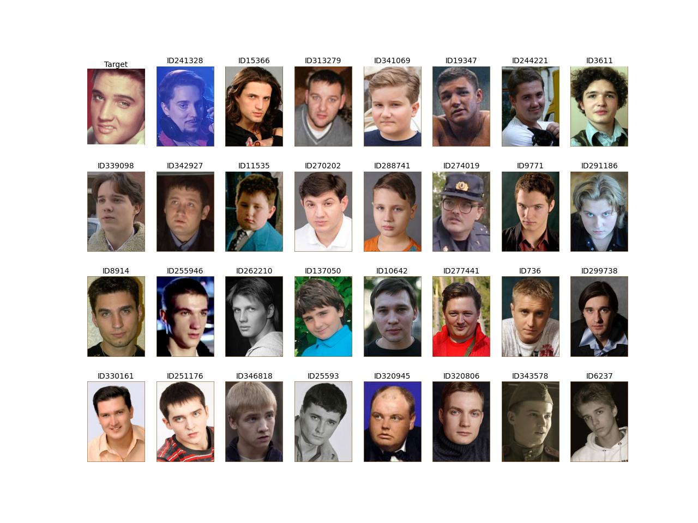

# Find Cast project

Do you need find russian actor to remake Fight Club? 
This is your solution to find cast most similar with original. 

[](https://colab.research.google.com/drive/1nTCNVoGHGBdOtS8B4WIYH1348LmVe71n#scrollTo=IoRdR6G_R6fz)

## Installation

```
git clone https://github.com/spbroma/find_cast
pip install -r requirements.txt
```

## Run

```
python Find_cast.py --help
python Find_cast.py -img *Path_to_img* -dump *Path_to_embdump* -n *Num_of_actors*
```

## Architecture

Embedding use [FaceNet](https://pypi.org/project/facenet-pytorch/), database russian actor from this [site](https://www.kino-teatr.ru/).

## Example
```cmd
python Find_cast.py -img input\elvis.jpg -n 31
```
